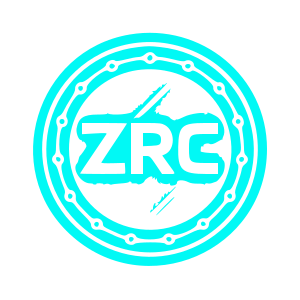

# Zerritech Token ($ZRC)

> Utility token for the ZERRITECH ecosystem on the BASE Network. $ZRC enables payments, rewards, and access to premium creator tools within the ZERRITECH Creator Hub.

---



## Quick links

* **Official website:** [https://www.zerritech.com](https://www.zerritech.com)
* **Contract (Base):** `0x02D77fe909fAeC72dE488fBf603E915a706343eA`
* **Explorer (BaseScan):** [https://basescan.org/token/0x02D77fe909fAeC72dE488fBf603E915a706343eA](https://basescan.org/token/0x02D77fe909fAeC72dE488fBf603E915a706343eA)
* **Recommended logo (SVG):** `logo.svg` (include in repo root or `/assets/`)

---

## Token Snapshot

| Field            |                                        Value |
| ---------------- | -------------------------------------------: |
| Name             |                              Zerritech Token |
| Symbol           |                                          ZRC |
| Decimals         |                                           18 |
| Total supply     |                              500,000,000 ZRC |
| Contract address | `0x02D77fe909fAeC72dE488fBf603E915a706343eA` |
| Network          |                     Base (Layer 2, Ethereum) |
| Status           |                                       Active |

---

## Description

**Zerritech Token ($ZRC)** is the native utility token of the ZERRITECH ecosystem. $ZRC is used for on‑platform payments, rewarding creators, tipping, and granting access to premium features inside the ZERRITECH Creator Hub.

---

## Official Resources

* **Website:** [https://www.zerritech.com](https://www.zerritech.com)
* **Documentation / Guides:** `/docs/` (add docs in repo)
* **Whitepaper (PDF):** `whitepaper.pdf` (include a concise mini whitepaper)
* **Roadmap:** `/docs/roadmap.md` or `/ROADMAP.md`
* **FAQ / Guide:** `/docs/guide.md`
* **Token Info (JSON):** `zrc-token.json` (see below)

---

## Social Links

* LinkedIn: [https://www.linkedin.com/company/zerritech-llc/](https://www.linkedin.com/company/zerritech-llc/)
* Twitter / X: [https://twitter.com/zerritech](https://twitter.com/zerritech)
* Telegram: [https://t.me/zerritech](https://t.me/zerritech)
* GitHub (source + contract): [https://github.com/zerritech](https://github.com/zerritech)

---

## Logo (SVG)

* **Filename:** `logo.svg`
* **Recommended size:** 32×32 px (platform integrations), provide larger vector (256×256) as source.

> The SVG included in this package is a clean, single-file vector (radial cyan→green gradient, center `ZRC`, outer ring node pattern, subtle glow). Use the raw `logo.svg` for GitHub/Explorer uploads.

**Place `logo.svg` in the repository root or `assets/` and reference the raw URL when submitting token info to explorers / wallets.**

---

## Roadmap (summary)

**Q4 2025**

* Contract verification on BaseScan (✅)
* Logo & token info update (✅)
* Launch mini whitepaper
* Presale

**Q1 2026**

* Integrate $ZRC with ZERRITECH Creator Hub
* First partnerships with creator platforms
* Initial DEX listings

**Q2 2026**

* Apply for CoinGecko and CoinMarketCap listing
* Expand utility (tipping, rewards)

**Q3–Q4 2026**

* Governance module development
* Strategic partnerships & ecosystem expansion

---

## Files to include in the repo (recommended structure)

```
/zrc-token-repo
├─ README.md                # This file
├─ logo.svg                 # Vector logo (recommended)
├─ whitepaper.pdf           # Mini whitepaper
├─ zrc-token.json           # Token metadata JSON (see below)
├─ /contracts
│  └─ ZRC.sol               # Verified contract source (optional, but recommended)
├─ /docs
│  ├─ roadmap.md
│  ├─ guide.md
│  └─ faq.md
```

---

## zrc-token.json (standard token info example)

```json
{
  "name": "Zerritech Token",
  "symbol": "ZRC",
  "decimals": 18,
  "description": "Utility token for the ZERRITECH ecosystem on the Base network. Used for payments, rewards, and access to premium creator tools.",
  "website": "https://www.zerritech.com",
  "explorer": "https://basescan.org/token/0x02D77fe909fAeC72dE488fBf603E915a706343eA",
  "socials": {
    "linkedin": "https://www.linkedin.com/company/zerritech-llc/",
    "twitter": "https://twitter.com/zerritech",
    "telegram": "https://t.me/zerritech",
    "github": "https://github.com/zerritech"
  },
  "logo_uri": "https://raw.githubusercontent.com/zerritech/<repo>/main/logo.svg",
  "chain": "base",
  "contract_address": "0x02D77fe909fAeC72dE488fBf603E915a706343eA",
  "status": "active",
  "verification": {
    "basescan_verified": true,
    "verification_date": "2025-10-01"
  }
}
```

> **Note:** replace `<repo>` with your actual GitHub repo path (e.g. `zerritech/zrc-token`).

---

## Submission checklist for listing (BaseScan / CoinGecko / TrustWallet / CMC)

1. Public GitHub repo with `README.md`, `logo.svg`, `zrc-token.json` and optional `contracts/` containing verified source.
2. Website reachable over **HTTPS** (no warnings).
3. Whitepaper and documentation links available in repo and on website.
4. Social links (LinkedIn, Twitter, Telegram, GitHub) in README.
5. Logo in **SVG** (32×32 recommended) and PNG alternatives (256×256).
6. Contract verified on BaseScan (done).
7. Token info JSON hosted in repo with correct raw URL.
8. Provide contact email/support and project owner identity for KYC requests.

---

## Disclaimer

This repository and materials are for informational purposes only. $ZRC does not constitute financial advice or an investment solicitation. Always perform your own due diligence.

---

© 2025 ZERRITECH LLC | All Rights Reserved | [https://www.zerritech.com](https://www.zerritech.com)

---

## SVG — `logo.svg` (copy this file into repo root or `/assets/`)

```svg
<?xml version="1.0" encoding="UTF-8"?>
<svg width="256" height="256" viewBox="0 0 256 256" xmlns="http://www.w3.org/2000/svg" role="img" aria-label="ZRC token logo">
  <defs>
    <radialGradient id="g1" cx="50%" cy="35%" r="70%">
      <stop offset="0%" stop-color="#06b6d4" />
      <stop offset="55%" stop-color="#22c55e" />
      <stop offset="100%" stop-color="#07111a" />
    </radialGradient>
    <filter id="glow" x="-50%" y="-50%" width="200%" height="200%">
      <feGaussianBlur stdDeviation="6" result="coloredBlur"/>
      <feMerge>
        <feMergeNode in="coloredBlur"/>
        <feMergeNode in="SourceGraphic"/>
      </feMerge>
    </filter>
  </defs>

  <!-- coin background -->
  <circle cx="128" cy="128" r="110" fill="url(#g1)" />

  <!-- outer ring (dotted nodes) -->
  <g transform="translate(128,128)" fill="#053236" opacity="0.95">
    <!-- create 12 small nodes around the circle -->
    <!-- positions calculated roughly -->
    <circle cx="0" cy="-96" r="6" />
    <circle cx="66" cy="-66" r="6" />
    <circle cx="96" cy="0" r="6" />
    <circle cx="66" cy="66" r="6" />
    <circle cx="0" cy="96" r="6" />
    <circle cx="-66" cy="66" r="6" />
    <circle cx="-96" cy="0" r="6" />
    <circle cx="-66" cy="-66" r="6" />
    <circle cx="32" cy="-94" r="4" />
    <circle cx="94" cy="-32" r="4" />
    <circle cx="32" cy="94" r="4" />
    <circle cx="-94" cy="32" r="4" />
  </g>

  <!-- inner circle slight border -->
  <circle cx="128" cy="128" r="78" fill="#06161b" opacity="0.45" />

  <!-- ZRC text -->
  <g filter="url(#glow)">
    <text x="128" y="150" text-anchor="middle" font-family="Helvetica, Arial, sans-serif" font-weight="700" font-size="64" fill="#ffffff">ZRC</text>
  </g>

  <!-- subtle shine -->
  <ellipse cx="100" cy="85" rx="60" ry="18" fill="#ffffff" opacity="0.06" transform="rotate(-20 100 85)" />
</svg>
```

---

Jika kamu mau, saya bisa:

* Meng-generate juga `logo.png` (256×256) dari SVG.
* Menyusun `zrc-token.json` ke file dan menaruh contoh path raw GitHub URL.
* Bantu submit token info ke BaseScan / TrustWallet PR (saya bisa siapkan deskripsi & PR template).
